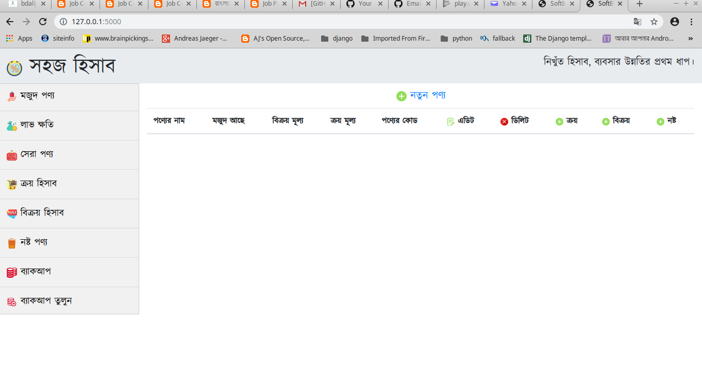

## Overview
This project is used for inventory calculation for any small business.Business owner can mange their business easily.
They can their daily sales, daily profit, daily return and overall stock of the business.

## Why this project

The purpose of site to get inventory calculation

## Features
* Easy user interface
* Show all product list
* Daily profit and loss calculation
* Daily purchase and sales
* Database backup system and recovery system

## Using library
* flask==1.0.2
* Flask-SQLAlchemy==2.3.2
* WTForms==2.2.1

### Project work flow

## Project Structure

      localization-text
        ├── app
            ├── __init__.py
            ├── forms.py
            ├── model.py
            ├── views.py 
        ├── tests
        ├── application.py
        ├── Dockerfile
        ├── generate_config.py
        ├── generate_config.py.sample
        ├── production_run.sh
        ├── requirement.txt
        ├── README.md
        # Coding patterns
        

* **views** *There are views for showing product list, purchase, sales and popular product.*

* **helper** *All type of supporting function are included here *

* **model** *All data model and query call from here by using sqlalchemy.*

* **forms** *There are different type of form are ProductForm, SalesForm, PurchaseForm, DamageForm*

## Prerequisites

To setup the project, you will need the following tools and machine configurations:

#### Run project using docker

- Minimum ubuntu 14.04 server or Minimum windows 7 server
- docker [setup docker](https://docs.docker.com/install/linux/docker-ce/ubuntu/)
- git [setup git](https://git-scm.com/book/en/v2/Getting-Started-Installing-Git)

#### Run project without docker

 - Minimum ubuntu 14.04 server or Minimum windows 7 server
 - git [setup git](https://git-scm.com/book/en/v2/Getting-Started-Installing-Git)
 - pip3 [setup pip3](https://pip.pypa.io/en/stable/installing/)
 - python 3.6 [setup python 3.7](https://www.python.org/doc/)
 - flask 1.0 [setup flask 1.0](http://flask.pocoo.org/docs/1.0/)

## How to run this project without docker

Clone **inventory** from GitLab using,

`git clone https://github.com/inventory.git`

Go to the cloned project directory using,

`cd inventory`

Install **virtualenv** if it's not already installed, by

`pip3 install virtualenv`

Make a virtualenv on project directory, using

`virtualenv .env`

Activate virtualenv.

* For *mac* and *linux*

`source .env/bin/activate`

* For *windows*

You can install *babun* tools for using *mac* and *linux* command.

See in details: http://babun.github.io/

Install the project dependencies in the following command

`pip3 install -r requirements.txt`

Run the project by executing _app.py_ file

`python3 app.py`
